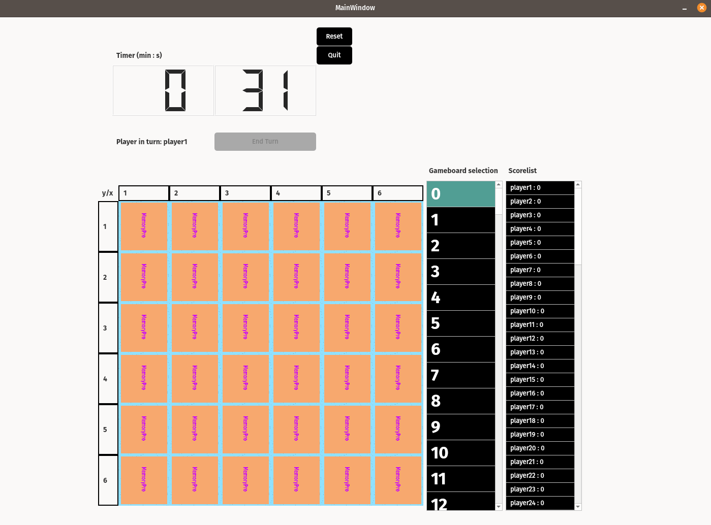
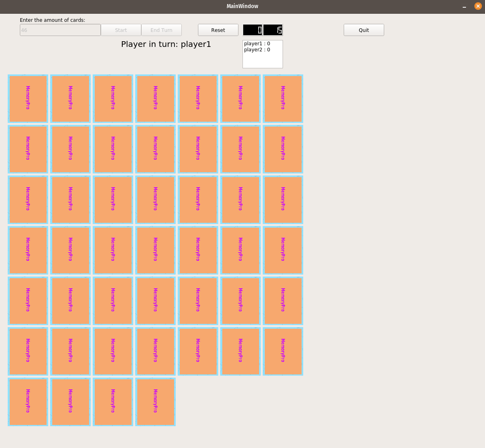

MemoryPro is an "endless" card pair memory game! Originally implemented for "software development 2" -course of Tampere University. It has then been updated to support 26 000+ pairs of cards with concurrency design and better ui.

Picture 1. Updated version of the game.
 
 

Picture 2. Old version of the game.

## Game's instructions
- Start the game by entering the number of players (2-99) and the desired number of cards (default range: 1-26000). Click the "Start" button to initiate the game and the timer.
- Players take turns revealing cards by clicking on them. After revealing, click the "End Turn" button. The card faces are hidden, and the turn passes to the next player unless the cards guessed were identical. In that case, the player continues their turn, and the correctly guessed cards remain visible.
- The game continues until all pairs of cards are revealed on the table.

- Reset the game at any point by pressing the reset key. This action prompts the re-entry of initial values (number of players and cards).
- Quit the game using the designated quit key.

## Future TODOs
1. Prio:
- Scoreboard sorting
- Custom graphics for face side of cards
- Save/load game functionality
- Better keyboard functionality: e.g. pressing y numkey + x numkey + enterkey reveals a card, after revealing cards enterkey ends turn
2. Prio:
- Online multiplayer
- User action animations

